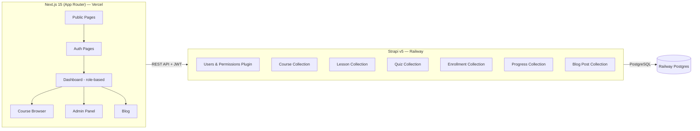
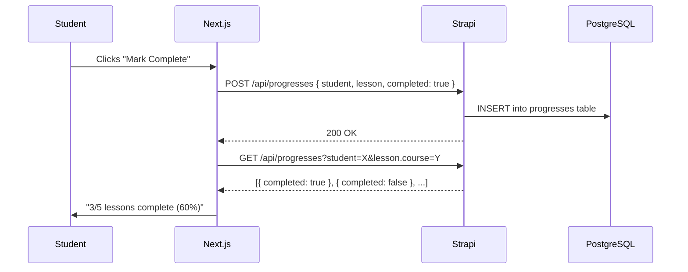

# LMS — Learning Management System — Implementation Plan

> [!IMPORTANT]
> **Deadline:** 30 August 2026, 11:59 PM. Today is 26 August — we have **~4.5 days**.
> The plan below is split into **7 phases** with explicit commit points. Each phase builds on the last so you always have a working, deployable state.

---

## Timeline Overview

| Day | Phase | What You Build |
|-----|-------|---------------|
| Day 1 (Aug 26) | Phase 1 + 2 | Strapi backend scaffold + Content Types + Auth |
| Day 2 (Aug 27) | Phase 3 | Next.js frontend scaffold + Auth pages + Role middleware |
| Day 3 (Aug 28) | Phase 4 + 5 | Course/Lesson CRUD + Enrollment + Lesson Viewer + Progress Tracking |
| Day 4 (Aug 29) | Phase 6 | Quiz system + Blog + Admin Dashboard |
| Day 5 (Aug 30) | Phase 7 | Deploy to Railway + Vercel, polish, record video |

---

## Architecture at a Glance



---

## Repo Structure

```
LMS/
├── backend/          ← Strapi v5 project
│   ├── src/
│   │   ├── api/      ← Content types (course, lesson, quiz, enrollment, progress, blog-post)
│   │   └── extensions/users-permissions/  ← Custom auth logic
│   ├── config/       ← DB, server, plugin config
│   └── ...
├── frontend/         ← Next.js 15 project
│   ├── src/
│   │   ├── app/      ← App Router pages
│   │   ├── components/
│   │   ├── lib/      ← API helpers, auth utils
│   │   └── middleware.ts  ← Route protection
│   └── ...
└── README.md
```

---

## Phase 1 — Strapi Backend Scaffold + Content Types

### What you'll learn
- How Strapi scaffolds a project and what each folder does
- How to define data models (Collection Types) that map to database tables
- How relations between models work (one-to-many, many-to-many)

### Steps

#### 1.1 Initialize Strapi
```bash
npx create-strapi@latest backend --quickstart --no-run
```
This creates `backend/` with SQLite for local dev. We'll switch to PostgreSQL for production later.

#### 1.2 Define Content Types (data models)

Each content type lives in `src/api/<name>/` and has a `schema.json` that describes its fields.

**Course** (`src/api/course/content-types/course/schema.json`)
| Field | Type | Notes |
|-------|------|-------|
| `title` | String | Required |
| `description` | RichText | Course overview |
| `thumbnail` | String | Image URL |
| `instructor` | Relation → User | Many-to-One (who created it) |
| `lessons` | Relation → Lesson | One-to-Many |
| `quizzes` | Relation → Quiz | One-to-Many |
| `enrollments` | Relation → Enrollment | One-to-Many |

**Lesson** (`src/api/lesson/`)
| Field | Type | Notes |
|-------|------|-------|
| `title` | String | Required |
| `content` | RichText | Text content |
| `videoUrl` | String | Optional YouTube/video URL |
| `order` | Integer | Sequence within course |
| `course` | Relation → Course | Many-to-One |

**Quiz** (`src/api/quiz/`)
| Field | Type | Notes |
|-------|------|-------|
| `title` | String | Quiz name |
| `course` | Relation → Course | Many-to-One |
| `questions` | JSON | Array of `{ question, options: string[], correctIndex: number }` |

**Enrollment** (`src/api/enrollment/`)
| Field | Type | Notes |
|-------|------|-------|
| `student` | Relation → User | Many-to-One |
| `course` | Relation → Course | Many-to-One |
| `enrolledAt` | DateTime | Auto-set |

**Progress** (`src/api/progress/`)
| Field | Type | Notes |
|-------|------|-------|
| `student` | Relation → User | Many-to-One |
| `lesson` | Relation → Lesson | Many-to-One |
| `completed` | Boolean | Default false |
| `completedAt` | DateTime | When marked done |

**QuizResult** (`src/api/quiz-result/`)
| Field | Type | Notes |
|-------|------|-------|
| `student` | Relation → User | Many-to-One |
| `quiz` | Relation → Quiz | Many-to-One |
| `score` | Integer | Number correct |
| `totalQuestions` | Integer | Total questions |
| `answers` | JSON | Student's submitted answers |

**BlogPost** (`src/api/blog-post/`)
| Field | Type | Notes |
|-------|------|-------|
| `title` | String | Required |
| `body` | RichText | Post content |
| `coverImage` | String | Cover image URL |
| `status` | Enumeration | `draft` / `published` |
| `author` | Relation → User | Many-to-One |

#### 🔀 COMMIT: `feat: initialize strapi backend with content type schemas`

---

## Phase 2 — Authentication + Role-Based Permissions in Strapi

### What you'll learn
- How Strapi's Users & Permissions plugin works
- How to create custom roles (Admin, Content Manager, Instructor, Student)
- How to write **custom policies** that enforce permissions at the API level

### Steps

#### 2.1 Configure Custom Roles
Strapi's Users & Permissions plugin has a `role` field on each user. We'll create 4 roles:
- `admin` (id: will be assigned)
- `content_manager`
- `instructor`
- `student`

This is done via the Strapi Admin Panel (Settings → Users & Permissions → Roles), or programmatically via a bootstrap script.

#### 2.2 Write a Bootstrap Script
`backend/src/index.ts` — runs on server start. It ensures the 4 roles exist:

```typescript
export default {
  async bootstrap({ strapi }) {
    // Create roles if they don't exist
    const roles = ['admin', 'content_manager', 'instructor', 'student'];
    for (const roleName of roles) {
      const existing = await strapi.query('plugin::users-permissions.role').findOne({
        where: { type: roleName },
      });
      if (!existing) {
        await strapi.query('plugin::users-permissions.role').create({
          data: { name: roleName, type: roleName, description: `${roleName} role` },
        });
      }
    }
  },
};
```

#### 2.3 Custom Policies for Backend Enforcement

> [!IMPORTANT]
> This is the **most evaluated part** — permissions must be enforced on the backend, not just by hiding UI.

We'll create reusable policies in `src/policies/`:

- **`is-admin.ts`** — checks `ctx.state.user.role.type === 'admin'`
- **`is-content-manager-or-admin.ts`** — allows admin or content_manager
- **`is-owner-or-admin.ts`** — for instructors: checks the resource belongs to them
- **`is-student.ts`** — only students can enroll / take quizzes

These policies are attached to routes in each content type's `routes/` folder.

**Example: Course Routes** (`src/api/course/routes/course.ts`)
```typescript
export default {
  routes: [
    { method: 'GET', path: '/courses', handler: 'course.find' },           // Public
    { method: 'GET', path: '/courses/:id', handler: 'course.findOne' },     // Public
    { method: 'POST', path: '/courses', handler: 'course.create',
      config: { policies: ['global::is-content-manager-or-admin'] } },
    { method: 'PUT', path: '/courses/:id', handler: 'course.update',
      config: { policies: ['global::is-owner-or-admin'] } },
    { method: 'DELETE', path: '/courses/:id', handler: 'course.delete',
      config: { policies: ['global::is-owner-or-admin'] } },
  ],
};
```

#### 2.4 Custom Controller Logic
For operations like enrollment, we'll write custom controllers that:
- Validate the user's role
- Check business rules (e.g., can't enroll twice)
- Auto-populate the `student` field from `ctx.state.user`

#### 2.5 Registration with Role Selection
Extend the register endpoint to accept a `role` field. Students default to `student`. Admins can later change any user's role via the admin panel API.

#### 🔀 COMMIT: `feat: add role-based authentication and custom policies`

---

## Phase 3 — Next.js Frontend Scaffold + Auth + Role Middleware

### What you'll learn
- Next.js 15 App Router structure (layout, page, loading, error files)
- How JWT auth works (login → store token → send with requests)
- How Next.js middleware protects routes before they even render

### Steps

#### 3.1 Initialize Next.js
```bash
npx create-next-app@latest frontend --app --ts --src-dir --eslint --no-tailwind
```

#### 3.2 Project Structure
```
frontend/src/
├── app/
│   ├── (auth)/           ← Login, Register pages
│   │   ├── login/page.tsx
│   │   └── register/page.tsx
│   ├── (dashboard)/      ← Protected area (role-based layouts)
│   │   ├── layout.tsx    ← Sidebar + header
│   │   ├── student/      ← Student pages
│   │   ├── instructor/   ← Instructor pages
│   │   ├── admin/        ← Admin pages
│   │   └── content-manager/
│   ├── courses/          ← Public course catalog
│   ├── blog/             ← Public blog
│   └── layout.tsx        ← Root layout (fonts, theme)
├── components/           ← Reusable UI components
├── lib/
│   ├── api.ts            ← Fetch wrapper with auth headers
│   ├── auth.ts           ← Login/register/logout helpers
│   └── types.ts          ← TypeScript interfaces
├── middleware.ts          ← Route protection
└── styles/
    └── globals.css        ← Design system
```

#### 3.3 Auth Flow (How Login Works — Line by Line)

**Step 1: User submits login form**
```typescript
// lib/auth.ts
export async function loginUser(email: string, password: string) {
  // 1. Send credentials to Strapi's auth endpoint
  const res = await fetch(`${STRAPI_URL}/api/auth/local`, {
    method: 'POST',
    headers: { 'Content-Type': 'application/json' },
    body: JSON.stringify({ identifier: email, password }),
  });
  
  // 2. Strapi returns { jwt, user } if valid
  const data = await res.json();
  
  // 3. Store JWT in an httpOnly cookie (secure, not accessible by JS)
  //    We use a Next.js API route for this
  await fetch('/api/auth/set-cookie', {
    method: 'POST',
    body: JSON.stringify({ token: data.jwt }),
  });
  
  return data.user;
}
```

**Step 2: Middleware checks every request**
```typescript
// middleware.ts
export function middleware(request: NextRequest) {
  const token = request.cookies.get('token')?.value;
  const role = request.cookies.get('role')?.value;
  const path = request.nextUrl.pathname;
  
  // If going to /admin/* and role isn't admin → redirect to /unauthorized
  if (path.startsWith('/admin') && role !== 'admin') {
    return NextResponse.redirect(new URL('/unauthorized', request.url));
  }
  // ... similar checks for other role-based paths
}
```

#### 3.4 API Helper (How Every API Call Works)
```typescript
// lib/api.ts
export async function fetchAPI(endpoint: string, options?: RequestInit) {
  const token = getTokenFromCookies();
  const res = await fetch(`${process.env.NEXT_PUBLIC_STRAPI_URL}${endpoint}`, {
    ...options,
    headers: {
      'Content-Type': 'application/json',
      ...(token && { Authorization: `Bearer ${token}` }),
      ...options?.headers,
    },
  });
  if (!res.ok) throw new Error(`API error: ${res.status}`);
  return res.json();
}
```

#### 3.5 Design System (CSS)
We'll create a clean, modern design with:
- CSS custom properties for theming (dark/light)
- Consistent spacing, typography (Inter font)
- Card-based layouts for courses
- Sidebar navigation for dashboards

#### 🔀 COMMIT: `feat: scaffold next.js frontend with auth and route protection`

---

## Phase 4 — Course Management + Enrollment + Lesson Viewer

### What you'll learn
- CRUD operations through the Strapi REST API
- How to build forms that create/edit data
- How to conditionally render UI based on user roles
- How enrollment creates a relationship between student and course

### Steps

#### 4.1 Course CRUD (Admin / Content Manager / Instructor)

**Create Course Page** — A form with title, description, thumbnail URL. On submit:
```typescript
const createCourse = async (formData) => {
  // The API helper sends the JWT automatically
  await fetchAPI('/api/courses', {
    method: 'POST',
    body: JSON.stringify({
      data: {
        title: formData.title,
        description: formData.description,
        thumbnail: formData.thumbnail,
        instructor: user.id,  // Auto-set to current user
      },
    }),
  });
};
```

**Course List** — Different views per role:
- Admin/CM: See all courses + edit/delete buttons
- Instructor: See only their courses + edit/delete
- Student: See course catalog + "Enroll" button

#### 4.2 Lesson Management (Under Each Course)

Each course page has an "Add Lesson" section (for admin/CM/instructor of that course).
Lessons are ordered by an `order` field. Students see them in sequence.

#### 4.3 Enrollment Flow

```typescript
// When student clicks "Enroll"
const enrollInCourse = async (courseId: number) => {
  await fetchAPI('/api/enrollments', {
    method: 'POST',
    body: JSON.stringify({
      data: {
        student: user.id,
        course: courseId,
        enrolledAt: new Date().toISOString(),
      },
    }),
  });
};
```

**"My Courses"** page: fetch enrollments where `student.id === currentUser.id`, then display those courses.

#### 4.4 Lesson Viewer

A sequential lesson viewer that shows:
- Lesson title + content (rendered rich text)
- Video embed (if videoUrl exists)
- "Previous" / "Next" navigation
- "Mark as Complete" button (→ Phase 5)

#### 🔀 COMMIT: `feat: add course management, enrollment, and lesson viewer`

---

## Phase 5 — Progress Tracking

### What you'll learn (this is asked about line-by-line in the video)
- How to track per-student, per-lesson completion
- How to compute a percentage from related data
- How data persists across refreshes (it's in the database, not localStorage)

### How Progress Works — Data Flow Explained



**Mark Complete (creates a Progress record):**
```typescript
const markLessonComplete = async (lessonId: number) => {
  // Check if progress record already exists
  const existing = await fetchAPI(
    `/api/progresses?filters[student][id][$eq]=${user.id}&filters[lesson][id][$eq]=${lessonId}`
  );
  
  if (existing.data.length === 0) {
    // Create new progress record
    await fetchAPI('/api/progresses', {
      method: 'POST',
      body: JSON.stringify({
        data: {
          student: user.id,
          lesson: lessonId,
          completed: true,
          completedAt: new Date().toISOString(),
        },
      }),
    });
  } else {
    // Update existing record
    await fetchAPI(`/api/progresses/${existing.data[0].documentId}`, {
      method: 'PUT',
      body: JSON.stringify({
        data: { completed: true, completedAt: new Date().toISOString() },
      }),
    });
  }
};
```

**Calculate Progress Percentage:**
```typescript
const calculateProgress = (completedLessons: number, totalLessons: number) => {
  if (totalLessons === 0) return 0;
  return Math.round((completedLessons / totalLessons) * 100);
};
// Example: 3 completed out of 5 total → 60%
```

**Where data is stored:** In the `progresses` table in PostgreSQL. Each row links a student to a lesson with a `completed` boolean. This persists across refreshes because it's database-backed, not in-memory.

#### 🔀 COMMIT: `feat: implement progress tracking with percentage display`

---

## Phase 6 — Quiz System + Blog + Admin Dashboard

### 6.1 Quiz with Auto-Grading

**Quiz Data Structure (stored as JSON in Strapi):**
```json
{
  "questions": [
    {
      "question": "What is React?",
      "options": ["A database", "A JS library", "An OS", "A language"],
      "correctIndex": 1
    }
  ]
}
```

**Auto-Grading Logic (this is asked about line-by-line in the video):**
```typescript
const gradeQuiz = (questions: Question[], studentAnswers: number[]) => {
  let score = 0;
  
  // Loop through each question
  for (let i = 0; i < questions.length; i++) {
    // Compare student's answer index with the correct answer index
    if (studentAnswers[i] === questions[i].correctIndex) {
      score += 1;  // Increment score for correct answer
    }
  }
  
  return {
    score,                          // e.g., 3
    totalQuestions: questions.length, // e.g., 5
    percentage: Math.round((score / questions.length) * 100), // e.g., 60%
  };
};
```

**Quiz submission flow:**
1. Student selects answers → stored in local state as `number[]`
2. On submit → `gradeQuiz()` runs client-side for instant feedback
3. Result is POSTed to `/api/quiz-results` for persistence
4. Student sees score immediately + can view it later under "My Results"

### 6.2 Blog System

**Content Manager / Admin can:**
- Create blog posts with title, body, cover image URL
- Set status to `draft` or `published`
- Only `published` posts are visible to students/public

**Public blog page** filters: `?filters[status][$eq]=published`

**Draft→Publish flow:**
```typescript
// Content Manager clicks "Publish"
await fetchAPI(`/api/blog-posts/${postId}`, {
  method: 'PUT',
  body: JSON.stringify({ data: { status: 'published' } }),
});
```

### 6.3 Admin Dashboard

A dedicated page at `/admin/` showing:

| Stat | How it's fetched |
|------|-----------------|
| Total Users per Role | `GET /api/users?filters[role][type][$eq]=student` (count for each role) |
| Total Courses | `GET /api/courses` (count) |
| Total Enrollments | `GET /api/enrollments` (count) |

**User Management Table:**
- Lists all users with their current role
- Admin can change any user's role via a dropdown → `PUT /api/users/:id` with new role
- Admin can delete users

**Course/Blog Management:**
- Admin sees all courses and blog posts across the platform
- Can edit/delete any of them

#### 🔀 COMMIT: `feat: add quiz system, blog, and admin dashboard`

---

## Phase 7 — Deployment + Polish + Video

### 7.1 Deploy Strapi to Railway

1. Push `backend/` to GitHub
2. In Railway: New Project → GitHub Repo → select `backend/`
3. Add PostgreSQL database service
4. Set environment variables:

| Variable | Value |
|----------|-------|
| `DATABASE_CLIENT` | `postgres` |
| `DATABASE_HOST` | `${{Postgres.PGHOST}}` |
| `DATABASE_PORT` | `${{Postgres.PGPORT}}` |
| `DATABASE_NAME` | `${{Postgres.PGDATABASE}}` |
| `DATABASE_USERNAME` | `${{Postgres.PGUSER}}` |
| `DATABASE_PASSWORD` | `${{Postgres.PGPASSWORD}}` |
| `NODE_ENV` | `production` |
| `APP_KEYS` | Generate with `openssl rand -base64 32` |
| `API_TOKEN_SALT` | Generate |
| `ADMIN_JWT_SECRET` | Generate |
| `JWT_SECRET` | Generate |

### 7.2 Deploy Next.js to Vercel

1. Push `frontend/` to GitHub (or monorepo with root dir set to `frontend/`)
2. In Vercel: Import → set root directory to `frontend/`
3. Set environment variable:
   - `NEXT_PUBLIC_STRAPI_URL` = your Railway Strapi URL

### 7.3 Polish

- Responsive design check
- Error handling (show user-friendly errors)
- Loading states (skeletons / spinners)
- Empty states ("No courses yet")

#### 🔀 COMMIT: `feat: configure deployment and polish UI`

### 7.4 README

Write the README with:
- How to run locally (both backend and frontend)
- Which features you completed
- Links to deployed URLs

#### 🔀 COMMIT: `docs: add comprehensive README`

---

## Video Walkthrough Script (10 minutes)

> [!TIP]
> I'll help you draft a detailed script and talking points for each section when we get to Day 5.

| Section | Duration | What to Show |
|---------|----------|-------------|
| **1. Live Demo — Student** | 2 min | Register → Browse → Enroll → View Lessons → Mark Complete → Progress bar updates → Take Quiz → See Score |
| **2. Live Demo — Instructor/CM** | 1.5 min | Login as instructor → Create Course → Add Lessons → Create Quiz → Write Blog Post (draft → publish) |
| **3. Live Demo — Admin** | 1 min | Admin panel → Stats → Change a user's role → Manage courses/blogs |
| **4. Data Flow** | 1.5 min | Pick "Enrollment": show form → API call → Strapi controller → DB → response → UI update |
| **5. Role-Based Access** | 1 min | Show policy files → show middleware.ts → try accessing admin route as student (blocked) |
| **6. Progress Tracking** | 1.5 min | Show `markLessonComplete` function → `calculateProgress` → show DB record in Strapi admin |
| **7. Quiz Grading** | 1 min | Show `gradeQuiz` function → walk through the loop → show result in DB |
| **8. Deployment** | 0.5 min | Show Railway dashboard → Vercel dashboard → env vars |

---

## Open Questions

> [!IMPORTANT]
> Please review these before we start coding:

1. **Database for local dev:** Should we use SQLite locally (simpler, default) and PostgreSQL only on Railway? Or do you want PostgreSQL locally too? *Recommendation: SQLite locally for speed, PostgreSQL on Railway.*

2. **CSS Framework:** The spec doesn't mandate one. I'll use vanilla CSS with custom properties for a clean, modern look. If you have a preference (e.g., you know CSS Modules well), let me know.

3. **Rich Text Editor:** For blog/lesson content, should we use a simple textarea or integrate a proper editor like TipTap? *Recommendation: Start with textarea/markdown, upgrade if time permits.*

4. **Monorepo vs Separate Repos:** The spec says "GitHub repository link (public — both frontend + backend)." I recommend a **single monorepo** with `frontend/` and `backend/` folders. Agree?

---

## Verification Plan

### Automated Tests
- Manual API testing with REST client (or Strapi admin panel) for each permission scenario
- Test each role can only access what it's supposed to

### Manual Verification
- Walk through the complete flow for all 4 roles on the deployed app
- Verify progress persists across page refreshes and logouts
- Verify quiz results are stored and retrievable
- Verify draft blog posts are hidden from public
- Test unauthorized access attempts (direct URL access, API calls without proper role)
